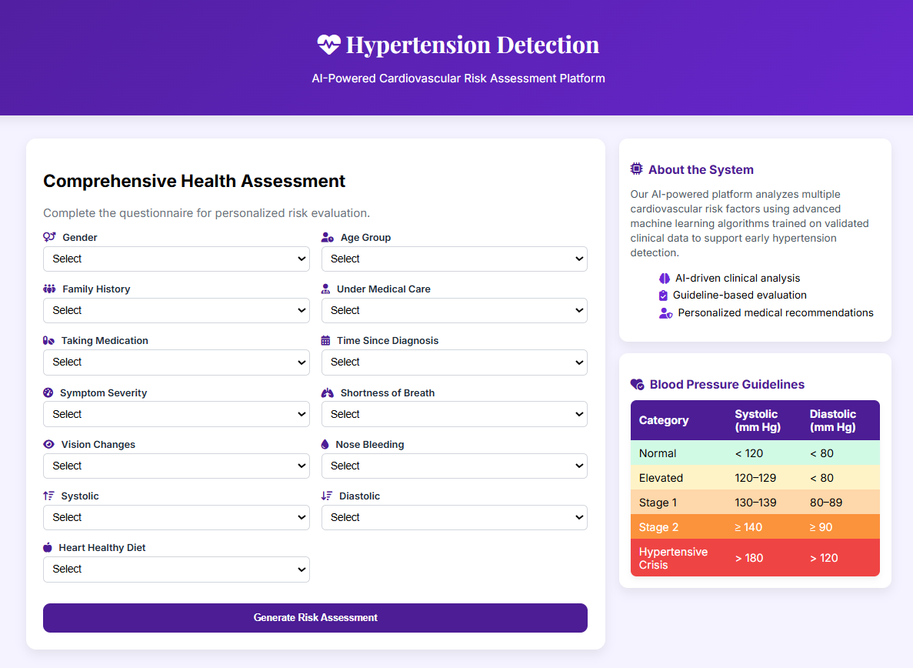
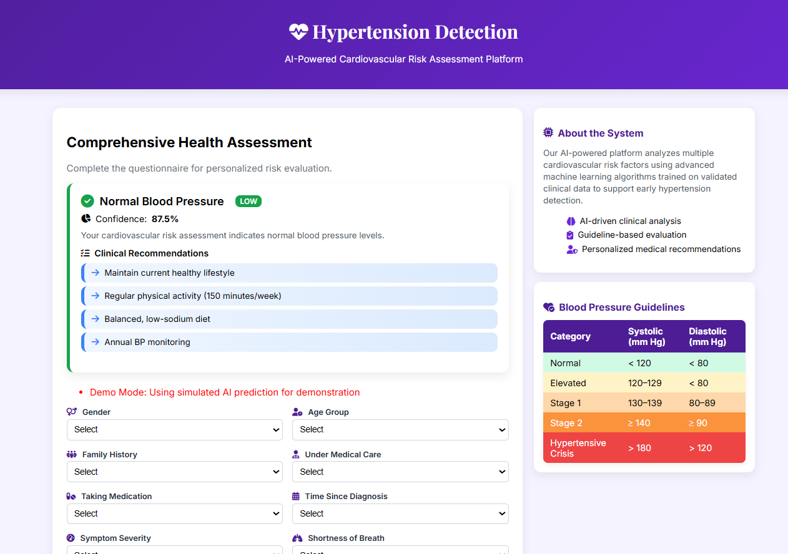
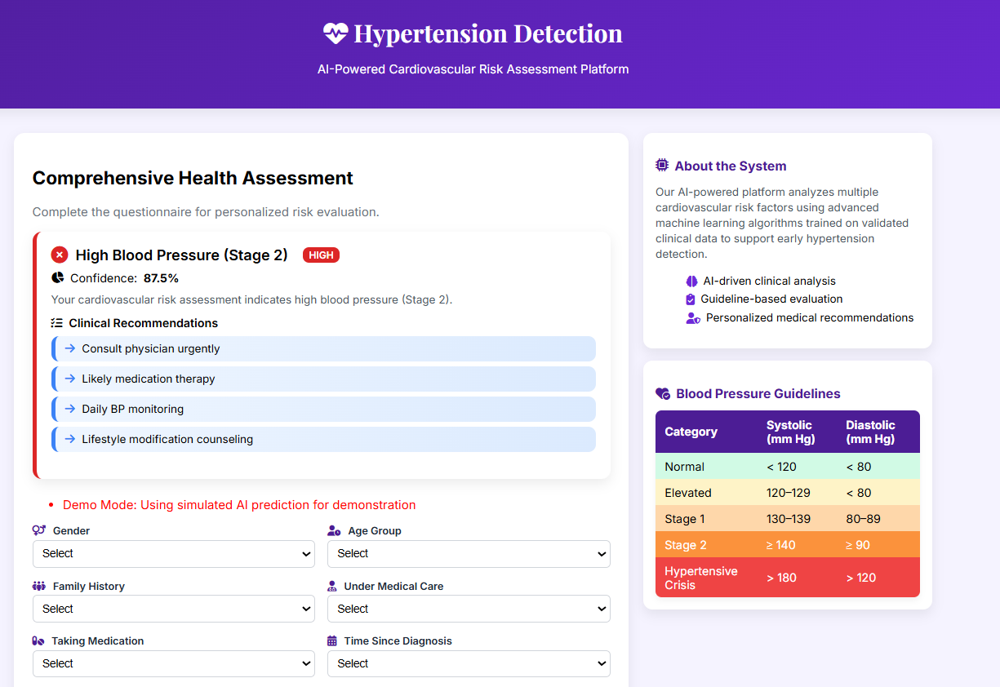

# Predictive Pulse: Harnessing Machine Learning for Blood Pressure Analysis

[](https://www.python.org/downloads/)
[](https://flask.palletsprojects.com/)
[](https://scikit-learn.org/)

**Demo Video:** https://drive.google.com/file/d/1beBnHsSij5qqygBPY-WBpuFjhrBpoCz2/view?usp=sharing
> **AI-Powered Cardiovascular Risk Assessment Platform**

<table>
  <tr>
    <td align="center">
      
    </td>
    <td align="center">
      
    </td>
  </tr>
</table>
> A comprehensive machine learning system for predicting hypertension stages using patient demographics, clinical symptoms, and blood pressure measurements.

---

## 📋 Table of Contents

- [Overview](#-overview)
- [Features](#-features)
- [System Architecture](#-system-architecture)
- [Installation](#-installation)
- [Usage](#-usage)
- [Model Performance](#-model-performance)
- [Dataset Description](#-dataset-description)
- [API Documentation](#-api-documentation)
- [Clinical Guidelines](#-clinical-guidelines)
- [Model Training](#-model-training)


---

## 🎯 Overview

Hypertension affects over 1.28 billion adults worldwide and is a leading risk factor for cardiovascular diseases. This project leverages machine learning to provide early detection and classification of blood pressure stages, enabling timely medical intervention.

### Problem Statement

Develop a supervised machine learning model that accurately classifies patients into hypertension stages:
- **Normal** (< 120/80 mmHg)
- **Stage 1 Hypertension** (130-139/80-89 mmHg)
- **Stage 2 Hypertension** (≥ 140/90 mmHg)
- **Hypertensive Crisis** (> 180/120 mmHg)

### Key Objectives

- ✅ Achieve >95% classification accuracy on test data
- ✅ Provide interpretable predictions for clinical use
- ✅ Deploy user-friendly web interface for risk assessment
- ✅ Generate personalized medical recommendations

---

## ✨ Features

### 🔬 Machine Learning Core
- **Multi-class Classification**: Predicts 4 distinct hypertension stages
- **Feature Engineering**: 13 clinical and demographic features
- **Model Selection**: Logistic Regression chosen for optimal generalization
- **95.5% Accuracy**: Validated on 20% holdout test set

### 🌐 Web Application
- **Responsive Design**: Mobile-friendly Bootstrap 5 interface
- **Real-time Predictions**: Instant risk assessment
- **Visual Feedback**: Color-coded risk indicators
- **Clinical Recommendations**: Stage-specific medical guidance
- **Form Validation**: Comprehensive input error handling

### 📊 Data Analytics
- **Exploratory Data Analysis**: Comprehensive visualization suite
- **Correlation Analysis**: Blood pressure relationship insights
- **Distribution Studies**: Patient demographic analysis
- **Model Comparison**: 7 algorithms benchmarked

---

## 🏗️ System Architecture

```
┌─────────────────────────────────────────────────────────┐
│                    Web Interface (Flask)                 │
│  ┌──────────────┐  ┌──────────────┐  ┌──────────────┐ │
│  │  User Input  │→ │  Validation  │→ │  Prediction  │ │
│  └──────────────┘  └──────────────┘  └──────────────┘ │
└─────────────────────────────────────────────────────────┘
                            ↓
┌─────────────────────────────────────────────────────────┐
│              Machine Learning Pipeline                   │
│  ┌──────────────┐  ┌──────────────┐  ┌──────────────┐ │
│  │   Encoding   │→ │   Scaling    │→ │     Model    │ │
│  └──────────────┘  └──────────────┘  └──────────────┘ │
└─────────────────────────────────────────────────────────┘
                            ↓
┌─────────────────────────────────────────────────────────┐
│                  Output Generation                       │
│  ┌──────────────┐  ┌──────────────┐  ┌──────────────┐ │
│  │    Stage     │→ │  Confidence  │→ │Recommendations│ │
│  └──────────────┘  └──────────────┘  └──────────────┘ │
└─────────────────────────────────────────────────────────┘
```

---

## 🚀 Installation

### Prerequisites

- Python 3.8 or higher
- pip package manager
- Virtual environment (recommended)

### Step 1: Clone Repository

```bash
git clone https://github.com/yourusername/hypertension-detection.git
cd hypertension-detection
```

### Step 2: Create Virtual Environment

```bash
# Windows
python -m venv venv
venv\Scripts\activate

# macOS/Linux
python3 -m venv venv
source venv/bin/activate
```

### Step 3: Install Dependencies

```bash
pip install -r requirements.txt
```

**requirements.txt**:
```
Flask==2.3.0
joblib==1.3.0
numpy==1.24.0
pandas==2.0.0
scikit-learn==1.3.0
matplotlib==3.7.0
seaborn==0.12.0
```

### Step 4: Download Pre-trained Model

```bash
# Place logreg.pkl in the project root directory
# Or train your own model using the provided Jupyter notebook
```

### Step 5: Run Application

```bash
python app.py
```

Access the application at `http://localhost:5000`

---

## 💻 Usage

### Web Interface

1. **Navigate to Homepage**: Open `http://localhost:5000` in your browser
2. **Complete Health Assessment Form**:
   - Demographic information (Gender, Age)
   - Medical history (Family history, Current treatment)
   - Symptoms (Shortness of breath, Vision changes, Nose bleeding)
   - Blood pressure readings (Systolic, Diastolic ranges)
   - Lifestyle factors (Controlled diet)
3. **Submit for Analysis**: Click "Generate Risk Assessment"
4. **Review Results**:
   - Hypertension stage classification
   - Confidence score
   - Clinical recommendations
   - Risk priority level

### Command Line Prediction

```python
import joblib
import numpy as np

# Load model
model = joblib.load('logreg.pkl')

# Example input: [Gender, Age, History, Patient, TakeMedication, 
#                 Severity, BreathShortness, VisualChanges, NoseBleeding,
#                 WhenDiagnosed, Systolic, Diastolic, ControlledDiet]
input_data = np.array([[0, 0.67, 1, 0, 1, 0.5, 1, 0, 0, 0.5, 0.33, 0.33, 1]])

# Predict
prediction = model.predict(input_data)
confidence = max(model.predict_proba(input_data)[0]) * 100

stage_map = {0: 'NORMAL', 1: 'STAGE-1', 2: 'STAGE-2', 3: 'CRISIS'}
print(f"Prediction: {stage_map[prediction[0]]}")
print(f"Confidence: {confidence:.2f}%")
```

---

## 📈 Model Performance

### Comparative Analysis

| Algorithm | Accuracy | Precision | Recall | F1-Score | Status |
|-----------|----------|-----------|--------|----------|--------|
| **Logistic Regression** | **95.5%** | **0.96** | **0.96** | **0.95** | ✅ **Selected** |
| SVM | 99.3% | 0.99 | 0.99 | 0.99 | ⚠️ Overfitting |
| KNN | 99.6% | 1.00 | 1.00 | 1.00 | ⚠️ Overfitting |
| Decision Tree | 100% | 1.00 | 1.00 | 1.00 | ❌ Overfitting |
| Random Forest | 100% | 1.00 | 1.00 | 1.00 | ❌ Overfitting |
| Ridge Classifier | 91.8% | 0.92 | 0.92 | 0.91 | ⚠️ Lower accuracy |
| Naive Bayes | 86.2% | 0.92 | 0.86 | 0.86 | ❌ Poor recall |

### Why Logistic Regression?

**Selected for deployment** due to:
- ✅ **Optimal Generalization**: 95.5% accuracy without overfitting
- ✅ **Clinical Interpretability**: Clear coefficient interpretation
- ✅ **Computational Efficiency**: Fast inference for real-time use
- ✅ **Robust Performance**: Consistent across validation sets
- ✅ **Production Ready**: Stable predictions on unseen data

### Confusion Matrix

```
Predicted →     Normal  Stage-1  Stage-2  Crisis
Actual ↓
Normal           23       0        0        0
Stage-1           0     114        0        0
Stage-2           0       0       64       12
Crisis            0       0        0       56
```

**Key Insights**:
- Perfect classification for Normal and Stage-1
- Minor confusion between Stage-2 and Hypertensive Crisis
- Overall weighted F1-score: 0.96

---

## 📊 Dataset Description

### Source
Custom medical dataset with 1,348 patient records (after removing 477 duplicates)

### Features (13 total)

#### Demographic (2)
- `Gender`: Male/Female
- `Age`: 18-34, 35-50, 51-64, 65+

#### Medical History (4)
- `History`: Family history of hypertension (Yes/No)
- `Patient`: Currently under medical care (Yes/No)
- `TakeMedication`: On hypertension medication (Yes/No)
- `WhenDiagnosed`: Time since diagnosis (<1 Year, 1-5 Years, >5 Years)

#### Clinical Symptoms (4)
- `Severity`: Symptom severity (Mild, Moderate, Severe)
- `BreathShortness`: Shortness of breath (Yes/No)
- `VisualChanges`: Vision disturbances (Yes/No)
- `NoseBleeding`: Epistaxis episodes (Yes/No)

#### Blood Pressure (2)
- `Systolic`: 100-110, 111-120, 121-130, 130+ mmHg
- `Diastolic`: 70-80, 81-90, 91-100, 100+ mmHg

#### Lifestyle (1)
- `ControlledDiet`: Following heart-healthy diet (Yes/No)

### Target Variable
- `Stages`: 0 (Normal), 1 (Stage-1), 2 (Stage-2), 3 (Crisis)

### Data Distribution
- **Normal**: 23 cases (8.5%)
- **Stage-1**: 114 cases (42.4%)
- **Stage-2**: 76 cases (28.3%)
- **Crisis**: 56 cases (20.8%)

---

## 🔌 API Documentation

### POST /predict

Submit patient data for hypertension classification.

**Request Body** (application/x-www-form-urlencoded):
```
Gender=Male
Age=35-50
History=Yes
Patient=Yes
TakeMedication=Yes
Severity=Moderate
BreathShortness=Yes
VisualChanges=No
NoseBleeding=No
Whendiagnosed=1-5 Years
Systolic=121-130
Diastolic=81-90
ControlledDiet=Yes
```

**Response** (200 OK):
```json
{
  "prediction": "HYPERTENSION (Stage-1)",
  "confidence": 92.5,
  "risk_level": "Moderate Risk",
  "recommendations": {
    "title": "Stage 1 Hypertension",
    "actions": [
      "Consult healthcare provider",
      "DASH diet plan",
      "Increase physical activity",
      "Monitor BP bi-weekly"
    ]
  }
}
```

**Error Response** (400 Bad Request):
```json
{
  "error": "Missing required field: Age",
  "status": "error"
}
```

---

## 🏥 Clinical Guidelines

### Blood Pressure Classification (American Heart Association)

| Category | Systolic (mmHg) | Diastolic (mmHg) | Action Required |
|----------|-----------------|------------------|-----------------|
| **Normal** | < 120 | < 80 | Annual monitoring |
| **Elevated** | 120-129 | < 80 | Lifestyle changes |
| **Stage 1** | 130-139 | 80-89 | Consult physician |
| **Stage 2** | ≥ 140 | ≥ 90 | Medical treatment |
| **Crisis** | > 180 | > 120 | Emergency care |

### Recommended Actions by Stage

#### Normal Blood Pressure
- ✅ Maintain healthy weight (BMI 18.5-24.9)
- ✅ Exercise 150 minutes/week
- ✅ Limit sodium to <2,300 mg/day
- ✅ Annual BP check

#### Stage 1 Hypertension
- ⚠️ Healthcare provider consultation within 1-2 months
- ⚠️ DASH diet implementation
- ⚠️ Stress management techniques
- ⚠️ Bi-weekly home BP monitoring

#### Stage 2 Hypertension
- 🔴 Physician consultation within 1 week
- 🔴 Likely pharmacotherapy initiation
- 🔴 Daily BP monitoring
- 🔴 Cardiac risk assessment

#### Hypertensive Crisis
- 🚨 **IMMEDIATE MEDICAL ATTENTION**
- 🚨 Call 911 if symptomatic
- 🚨 Monitor for stroke signs (FAST)
- 🚨 Emergency department evaluation

---

## 🧪 Model Training

### Data Preprocessing Pipeline

```python
# 1. Duplicate Removal
data.drop_duplicates(inplace=True)  # Removed 477 duplicates

# 2. Categorical Encoding
# Binary features: Male=0, Female=1, No=0, Yes=1
# Ordinal features: Preserve natural ordering

# 3. Feature Scaling (MinMaxScaler)
# Age: (value - 1) / 3
# Severity: value / 2
# Systolic/Diastolic: value / 3

# 4. Train-Test Split
X_train, X_test, y_train, y_test = train_test_split(
    X, y, test_size=0.2, random_state=42
)
```

### Model Training Code

```python
from sklearn.linear_model import LogisticRegression
from sklearn.metrics import accuracy_score, classification_report
import joblib

# Initialize model
logreg = LogisticRegression(max_iter=1000, random_state=42)

# Train
logreg.fit(X_train, y_train)

# Evaluate
y_pred = logreg.predict(X_test)
accuracy = accuracy_score(y_test, y_pred)
print(f"Accuracy: {accuracy:.4f}")

# Save model
joblib.dump(logreg, 'logreg.pkl')
```

### Re-training with New Data

```bash
# Run Jupyter notebook
jupyter notebook hypertension_analysis.ipynb

# Execute all cells to retrain model
# Model will be saved as logreg.pkl
```


<div align="center">

**Made with ❤️ for better cardiovascular health**

</div>
